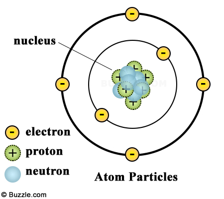

# Particle Simulator

#### This is a particle simulator using SDL (Simple Direct Media Layer) and C++. This application simulates how electrons behave and move around atoms at the molecular level by manipulating bits on the screen. The particles change colors the longer you keep this program running.

  <ul>
    <li>To run this program, you must have the SDL library set up in your IDE. </li>
  </ul>

  
  

